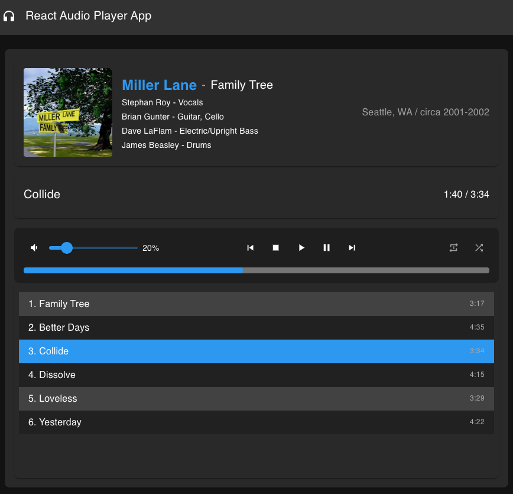

# 🎵 React Audio Player App

[](https://reactjs.org/)
[](https://mui.com/)
[](https://www.typescriptlang.org/)
[](https://nodejs.org/)
[](https://github.com/pmndrs/zustand)

> A sleek, modern music player built with React, Material-UI, TypeScript, and Howler.js. Enjoy smooth playback, skip and shuffle tracks, and manage playlists with a responsive, dark-themed design.

---

## 🎨 **Features**

- 🎶 **Play/Pause Control:** Smooth playback control with responsive animations.
- ⏩ **Skip Tracks:** Effortlessly navigate between tracks.
- 🔁 **Shuffle and Repeat:** Toggle shuffle and repeat modes for a personalized listening experience.
- 🔊 **Volume Control:** Integrated volume slider with percentage display.
- 📱 **Mobile-First Design:** Fully responsive and optimized for mobile devices.
- 🛠 **Modern State Management:** Lightweight state management using Zustand with Redux DevTools integration.

---

## 📸 **Screenshots**



---

## 🚀 **Tech Stack**

- **React** - Frontend library for building user interfaces
- **Material-UI (MUI)** - UI component library and design system
- **TypeScript** - Static typing for more maintainable code
- **Howler.js** - Audio playback and management
- **Zustand** - State management for React
- **Webpack** - Bundling and development server

---

## 🔧 **Installation and Setup**

1. **Clone the repository:**
    ```bash
    git clone https://github.com/davelaflam/react-audio-player.git
    cd react-audio-player
    ```

2. **Install dependencies:**
    ```bash
    npm install
    ```

3. **Start the development server:**
    ```bash
    npm start
    ```
   or (depending on your scripts)
    ```bash
    npm run dev
    ```

4. **Build for production:**
    ```bash
    npm run build
    ```

5. **Preview the production build:**
    ```bash
    npm run preview
    ```

---

## 📖 **Usage**

- **Play/Pause:** Click the play/pause button to start or stop playback.
- **Skip Tracks:** Use the next and previous buttons to navigate between tracks.
- **Shuffle and Repeat:** Toggle shuffle and repeat modes for a personalized listening experience.
- **Volume Control:** Adjust the volume using the integrated slider.

---

## 🔗 **Links**

- **Live Demo:** [Demo Link](https://www.davelaflam.com/music)
- **GitHub Repository:** [react-audio-player](https://github.com/davelaflam/react-audio-player)
